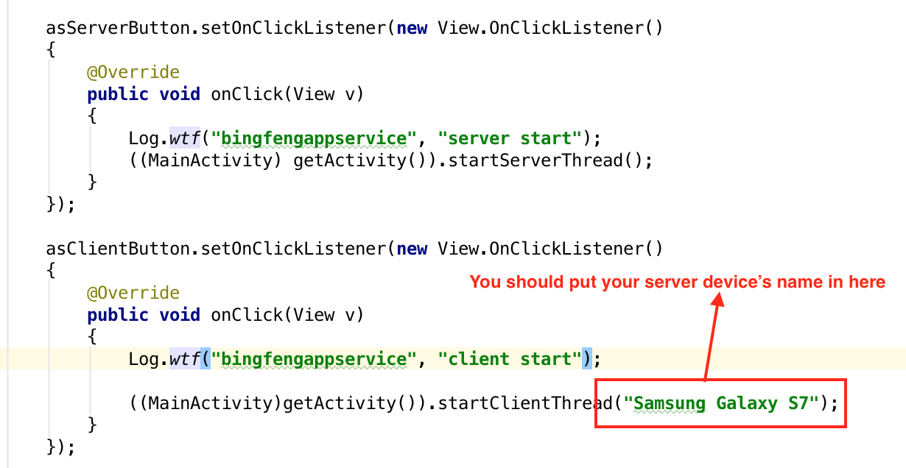
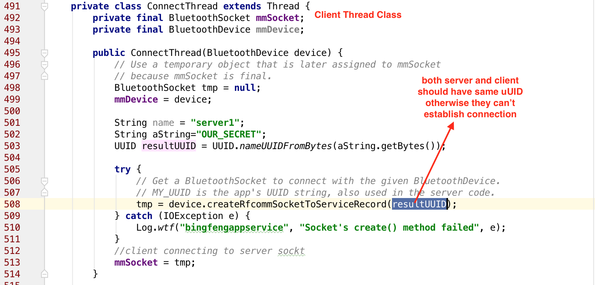
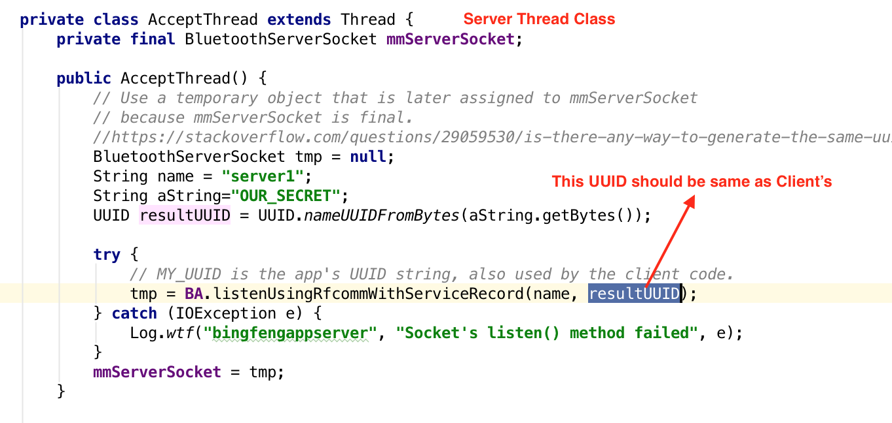
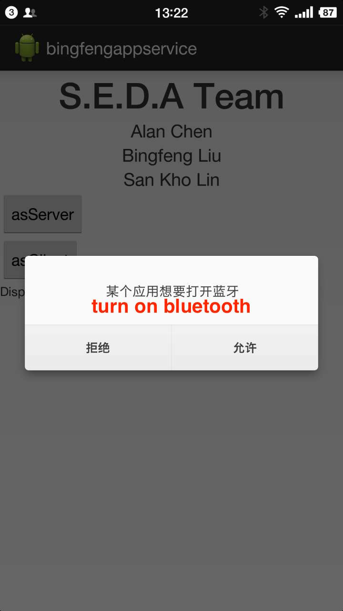
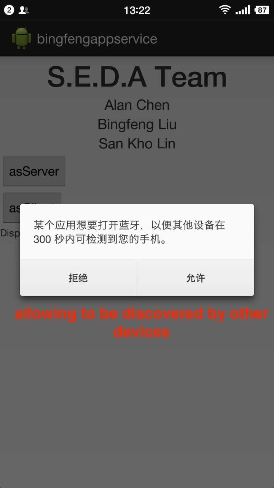
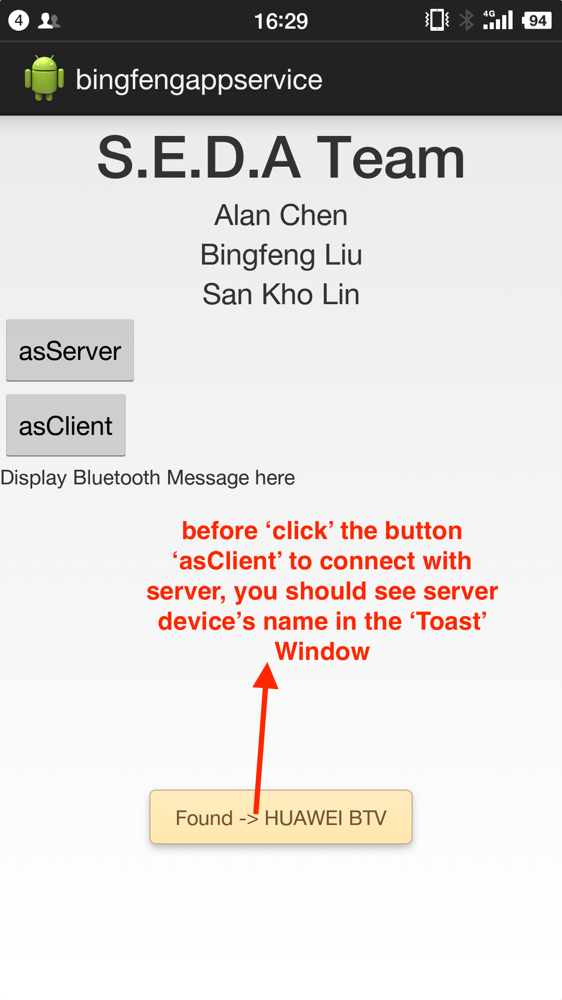
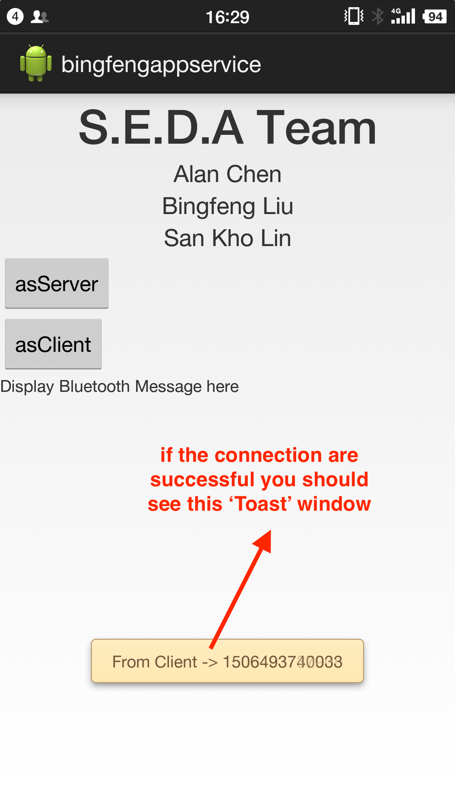
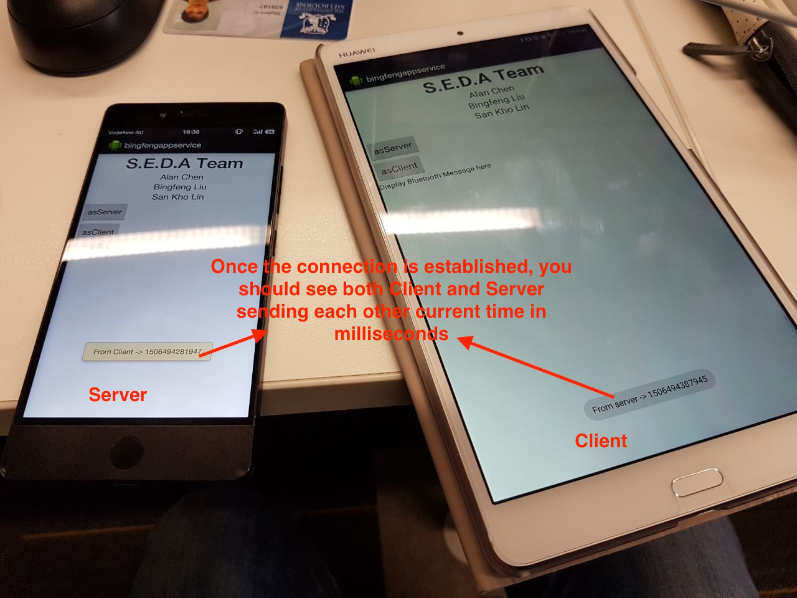

# Bluetooth connection instruction

## Code

1. In `GeneralContentFragment.java`, please make sure you put in your server device's name in the place as marked in Figure.1. (i.e. the name of the phone you want to use to act like a server.)

	
	**Figure.1**

2. Both server and client should use the same UUID to establish the connection since Bluetooth socket relied on the same UUID between client and server devices.

	
	**Figure.2**

	
	**Figture.2.1**

## UI

1. When you open the app (click `run` on Android Studio), you should see the app popped up two windows asking you to turn on Bluetooth (Figure.3) and ask you to allow your device to be discovered by other devices (Figure.4). It is important for Server device to be discovered by client devices, otherwise they can't establish connection via Bluetooth. Note: It might also popped up a window ask for 'location' permission (`ACCESS_COARSE_LOCATION`), which is also needed for Bluetooth connection, once you allowed it, it wont show up windows again, so I am not able to get screenshot for it.

	
	**Figure.3**

	
	**Figure.4**

2. After turning on Bluetooth and allowed to be discovered, you should have your server device click `asServer` button to set up server socket which is listening for incoming client socket. (Bluetooth is recommended to only allow one client connection which is documented on Google Android Bluetooth page.). The client device then could click 'asClient', button to actively connect to the server socket. The `asClient` must only be clicked after you see the server device's name in the 'Toast Window' as found (Figure.5, the server device's name is `HUAWEI BTV` in this case.).
	
	**Figure.5**

3. Once the connection is successfully established between server device and client device you should see Figure.6 and Figure.7.
	
	**Figure.6**

	
	**Figure.7**
